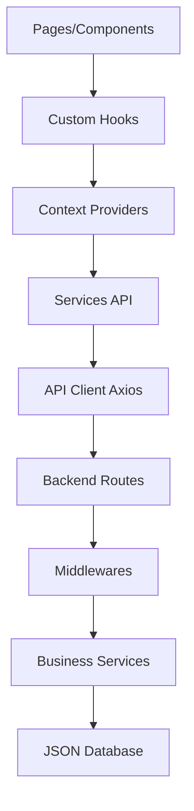

# Architecture Technique Finale - Riziky-Boutic

## 📋 Vue d'Ensemble Complète

Riziky-Boutic est une plateforme e-commerce moderne développée avec une architecture full-stack robuste, sécurisée et évolutive. Cette documentation présente l'architecture technique complète du projet.

---

## 🏗️ Architecture Globale

### Stack Technologique Complet

#### Frontend (Client-Side)
```
React 18.2.0          → Framework UI moderne avec hooks
TypeScript 5.0+       → Type safety et développement robuste
Vite 4.0+            → Build tool ultra-rapide
Tailwind CSS 3.3+    → Framework CSS utility-first
Shadcn/UI            → Composants UI pré-construits
Axios                → Client HTTP avec intercepteurs
Socket.io-client     → Communication temps réel
React Router 6.8+    → Routing côté client
Context API          → Gestion d'état global
```

#### Backend (Server-Side)
```
Node.js 18+          → Runtime JavaScript serveur
Express.js 4.18+     → Framework web minimaliste
Socket.io            → WebSocket pour temps réel
JWT                  → Authentification stateless
Helmet.js            → Sécurité headers HTTP
Multer               → Upload de fichiers
CORS                 → Cross-Origin Resource Sharing
Express-rate-limit   → Protection contre spam
```

#### Base de Données & Stockage
```
JSON Files           → Stockage fichiers (prototype)
File System          → Persistance directe
Memory Cache         → Cache en mémoire pour performance
Local Storage        → Stockage côté client
```

---

## 🔧 Structure Détaillée du Projet

### Architecture Frontend (`/src`)

```
src/
├── components/              # Composants réutilisables
│   ├── layout/             # Composants de mise en page
│   │   ├── Navbar.tsx      # → Navigation principale avec auth
│   │   ├── Footer.tsx      # → Pied de page avec liens
│   │   └── Sidebar.tsx     # → Navigation latérale admin
│   ├── products/           # Composants produits
│   │   ├── ProductCard.tsx # → Carte produit avec actions
│   │   ├── ProductGrid.tsx # → Grille responsive de produits
│   │   └── ProductFilter.tsx # → Filtres de recherche
│   ├── cart/               # Gestion du panier
│   │   ├── CartDrawer.tsx  # → Panier latéral
│   │   ├── CartItem.tsx    # → Item individuel du panier
│   │   └── CartSummary.tsx # → Résumé et totaux
│   ├── auth/               # Authentification
│   │   ├── LoginForm.tsx   # → Formulaire de connexion
│   │   ├── RegisterForm.tsx # → Formulaire d'inscription
│   │   └── ProtectedRoute.tsx # → Protection des routes
│   ├── admin/              # Interface administration
│   │   ├── Dashboard.tsx   # → Tableau de bord
│   │   ├── ProductManager.tsx # → Gestion produits
│   │   └── UserManager.tsx # → Gestion utilisateurs
│   ├── promotions/         # Promotions et ventes flash
│   │   ├── FlashSaleBanner.tsx # → Bannière vente flash
│   │   └── PromoCode.tsx   # → Codes promotionnels
│   └── ui/                 # Composants UI de base (Shadcn)
│       ├── button.tsx      # → Composant bouton personnalisé
│       ├── input.tsx       # → Champs de saisie
│       └── dialog.tsx      # → Modales et dialogues
├── hooks/                  # Hooks personnalisés métier
│   ├── useAuth.ts         # → Gestion authentification
│   ├── useProducts.ts     # → Gestion des produits
│   ├── useCart.ts         # → Gestion du panier
│   ├── useFavorites.ts    # → Gestion des favoris
│   └── useOrders.ts       # → Gestion des commandes
├── contexts/              # Contextes React pour état global
│   ├── AuthContext.tsx    # → État d'authentification
│   ├── StoreContext.tsx   # → État global du magasin
│   └── VideoCallContext.tsx # → État des appels vidéo
├── services/              # Services et API
│   ├── core/              # Configuration centrale
│   │   └── apiClient.ts   # → Client HTTP configuré
│   ├── modules/           # Services par domaine
│   │   ├── auth.service.ts # → Service authentification
│   │   ├── products.service.ts # → Service produits
│   │   ├── cart.service.ts # → Service panier
│   │   └── orders.service.ts # → Service commandes
│   ├── secureIds.ts       # → Sécurisation des IDs
│   └── socket.ts          # → Configuration WebSocket
├── types/                 # Définitions TypeScript
│   ├── auth.types.ts      # → Types authentification
│   ├── product.types.ts   # → Types produits
│   ├── order.types.ts     # → Types commandes
│   └── api.types.ts       # → Types API responses
├── utils/                 # Fonctions utilitaires
│   ├── formatters.ts      # → Formatage données (prix, dates)
│   ├── validators.ts      # → Validation formulaires
│   └── constants.ts       # → Constantes application
└── pages/                 # Pages de l'application
    ├── Home.tsx           # → Page d'accueil
    ├── ProductDetail.tsx  # → Détail produit
    ├── Cart.tsx           # → Page panier
    ├── Checkout.tsx       # → Processus de commande
    └── admin/             # Pages administration
        ├── AdminDashboard.tsx
        └── ProductManagement.tsx
```

### Architecture Backend (`/server`)

```
server/
├── routes/                # Routes API organisées par domaine
│   ├── auth.routes.js     # → /api/auth/* (login, register)
│   ├── products.routes.js # → /api/products/* (CRUD produits)
│   ├── cart.routes.js     # → /api/cart/* (gestion panier)
│   ├── orders.routes.js   # → /api/orders/* (commandes)
│   ├── users.routes.js    # → /api/users/* (gestion utilisateurs)
│   └── admin.routes.js    # → /api/admin/* (fonctions admin)
├── services/              # Logique métier
│   ├── auth.service.js    # → Logique authentification
│   ├── products.service.js # → Logique produits
│   ├── cart.service.js    # → Logique panier
│   ├── orders.service.js  # → Logique commandes
│   └── email.service.js   # → Service d'email
├── middlewares/           # Middlewares Express
│   ├── auth.middleware.js # → Vérification JWT
│   ├── security.js       # → Sécurité avancée
│   ├── validation.js     # → Validation des données
│   └── upload.middleware.js # → Upload de fichiers
├── core/                  # Modules centraux
│   ├── database.js       # → Gestion fichiers JSON
│   ├── logger.js         # → Système de logging
│   └── errorHandler.js   # → Gestion centralisée erreurs
├── data/                  # Fichiers de données JSON
│   ├── users.json        # → Données utilisateurs
│   ├── products.json     # → Catalogue produits
│   ├── orders.json       # → Commandes clients
│   ├── categories.json   # → Catégories de produits
│   ├── cart.json         # → Paniers utilisateurs
│   ├── favorites.json    # → Favoris utilisateurs
│   ├── reviews.json      # → Avis et commentaires
│   └── flash-sales.json  # → Ventes flash
├── socket/                # Configuration Socket.io
│   ├── socketHandler.js  # → Gestionnaire principal
│   ├── chatHandler.js    # → Chat en temps réel
│   └── notificationHandler.js # → Notifications push
├── uploads/               # Fichiers uploadés
│   ├── products/         # → Images produits
│   ├── users/            # → Photos de profil
│   └── temp/             # → Fichiers temporaires
└── config/                # Configuration serveur
    ├── database.config.js # → Config base de données
    ├── jwt.config.js     # → Configuration JWT
    └── cors.config.js    # → Configuration CORS
```

---

## 🔄 Flux de Données Détaillé

### 1. Architecture Frontend → Backend



### 2. Flux d'Authentification Sécurisé

```
1. User Login Request
   ↓
2. Frontend: loginForm.tsx → useAuth hook
   ↓
3. Service: auth.service.ts → apiClient.ts
   ↓
4. Backend: /api/auth/login → auth.middleware.js
   ↓
5. Service: auth.service.js → JWT generation
   ↓
6. Response: { token, user } → Frontend Context
   ↓
7. Token Storage: localStorage + HTTP headers
   ↓
8. Protected Routes: Automatic token validation
```

### 3. Gestion des Produits

```
1. Product Display Request
   ↓
2. Frontend: ProductGrid.tsx → useProducts hook
   ↓
3. Service: products.service.ts → GET /api/products
   ↓
4. Backend: products.routes.js → security middleware
   ↓
5. Service: products.service.js → products.json
   ↓
6. Data Processing: Filtering, sorting, pagination
   ↓
7. Response: Formatted products array
   ↓
8. Frontend: State update → UI re-render
```

---

## 🔒 Architecture de Sécurité

### 1. Couches de Sécurité Frontend

```typescript
// Sécurisation des routes
SecureRoute.tsx → Validation IDs sécurisés
ProtectedRoute.tsx → Vérification authentification
AdminRoute.tsx → Contrôle permissions admin

// Validation des données
Input Validation → Client-side validation
Type Safety → TypeScript strict mode
XSS Prevention → Sanitization des entrées
```

### 2. Couches de Sécurité Backend

```javascript
// Middlewares de sécurité en cascade
app.use(helmet())              // Headers sécurisés
app.use(cors())               // CORS configuré
app.use(rateLimiter)          // Limitation requêtes
app.use(sanitizeMiddleware)   // Nettoyage données
app.use(authMiddleware)       // Vérification JWT
app.use(securityLogger)       // Monitoring sécurité
```

### 3. Gestion des Sessions et Tokens

```
JWT Token Structure:
{
  "iss": "riziky-boutic",     // Émetteur
  "sub": "user_id",           // Sujet (ID utilisateur)
  "iat": 1642678800,          // Émis à
  "exp": 1642765200,          // Expire à
  "role": "user|admin",       // Rôle utilisateur
  "permissions": []           // Permissions spécifiques
}

Token Lifecycle:
1. Generation → Login success
2. Storage → localStorage (frontend)
3. Transmission → Authorization header
4. Validation → Every API request
5. Refresh → Before expiration
6. Revocation → Logout/security breach
```

---

## ⚡ Optimisations Performance

### 1. Frontend Performance

```typescript
// Code Splitting
const AdminDashboard = lazy(() => import('./pages/admin/AdminDashboard'));

// Memoization
const ProductCard = React.memo(({ product }) => { /* ... */ });

// Virtual Scrolling
const ProductList = () => {
  const virtualizedItems = useVirtualizer({ /* config */ });
  return /* virtualized list */;
};

// Image Optimization
const LazyImage = ({ src, alt }) => {
  const [isLoaded, setIsLoaded] = useState(false);
  const [isInView, setIsInView] = useState(false);
  // Intersection Observer implementation
};
```

### 2. Backend Performance

```javascript
// Caching Strategy
const cache = new Map();
const getCachedData = (key, fetcher, ttl = 300000) => {
  const cached = cache.get(key);
  if (cached && Date.now() - cached.timestamp < ttl) {
    return cached.data;
  }
  const data = fetcher();
  cache.set(key, { data, timestamp: Date.now() });
  return data;
};

// Request Optimization
app.use(compression()); // Gzip compression
app.use(express.static('uploads', { maxAge: '1y' })); // Static assets caching
```

### 3. Database Performance

```javascript
// Indexing Strategy (pour future migration vers vraie DB)
const indexedProducts = createIndex(products, ['category', 'price', 'name']);

// Pagination Implementation
const paginateResults = (data, page, limit) => {
  const startIndex = (page - 1) * limit;
  const endIndex = startIndex + limit;
  return {
    data: data.slice(startIndex, endIndex),
    pagination: {
      currentPage: page,
      totalPages: Math.ceil(data.length / limit),
      totalItems: data.length,
      hasNext: endIndex < data.length,
      hasPrev: startIndex > 0
    }
  };
};
```

---

## 🌐 Architecture de Communication

### 1. API REST Structure

```
Base URL: /api/v1

Authentication:
POST   /auth/login         → Connexion utilisateur
POST   /auth/register      → Inscription utilisateur
POST   /auth/refresh       → Rafraîchir token
POST   /auth/logout        → Déconnexion
GET    /auth/verify        → Vérifier token

Products:
GET    /products           → Liste tous les produits
GET    /products/:id       → Détail d'un produit
GET    /products/category/:name → Produits par catégorie
POST   /products/search    → Recherche avancée
POST   /products           → Créer produit (admin)
PUT    /products/:id       → Modifier produit (admin)
DELETE /products/:id       → Supprimer produit (admin)

Cart:
GET    /cart               → Récupérer panier utilisateur
POST   /cart/add           → Ajouter item au panier
PUT    /cart/update        → Modifier quantité item
DELETE /cart/remove        → Supprimer item du panier
DELETE /cart/clear         → Vider le panier

Orders:
GET    /orders             → Historique commandes utilisateur
POST   /orders             → Créer nouvelle commande
GET    /orders/:id         → Détail commande
PUT    /orders/:id/status  → Modifier statut (admin)

Admin:
GET    /admin/dashboard    → Statistiques dashboard
GET    /admin/users        → Gestion utilisateurs
GET    /admin/orders       → Toutes les commandes
POST   /admin/flash-sales  → Créer vente flash
```

### 2. WebSocket Events

```javascript
// Client → Server Events
'user:join'          → Utilisateur rejoint le chat
'message:send'       → Envoyer message
'order:track'        → Suivre commande en temps réel
'product:view'       → Vue produit (analytics)

// Server → Client Events
'message:received'   → Nouveau message reçu
'order:updated'      → Statut commande mis à jour
'notification:new'   → Nouvelle notification
'user:status'        → Statut utilisateur changé
'flash-sale:start'   → Début vente flash
'stock:updated'      → Stock produit mis à jour
```

### 3. Error Handling Strategy

```typescript
// Frontend Error Boundaries
class APIErrorBoundary extends React.Component {
  componentDidCatch(error: Error, errorInfo: React.ErrorInfo) {
    // Log to monitoring service
    console.error('API Error:', error, errorInfo);
    // Show user-friendly message
    toast.error('Une erreur inattendue est survenue');
  }
}

// Backend Error Middleware
const errorHandler = (err, req, res, next) => {
  const status = err.status || 500;
  const message = err.message || 'Erreur serveur interne';
  
  // Log détaillé pour debugging
  console.error(`Error ${status}: ${message}`, {
    url: req.originalUrl,
    method: req.method,
    ip: req.ip,
    userAgent: req.get('User-Agent'),
    stack: err.stack
  });
  
  // Response formatée pour le client
  res.status(status).json({
    error: message,
    timestamp: new Date().toISOString(),
    path: req.originalUrl
  });
};
```

---

## 📊 Monitoring et Observabilité

### 1. Logging Strategy

```javascript
// Structured Logging
const logger = {
  info: (message, meta = {}) => {
    console.log(JSON.stringify({
      level: 'info',
      message,
      timestamp: new Date().toISOString(),
      ...meta
    }));
  },
  
  error: (message, error, meta = {}) => {
    console.error(JSON.stringify({
      level: 'error',
      message,
      error: error.message,
      stack: error.stack,
      timestamp: new Date().toISOString(),
      ...meta
    }));
  }
};
```

### 2. Metrics Collection

```javascript
// Performance Metrics
const metrics = {
  requestDuration: new Map(),
  errorCount: 0,
  activeUsers: new Set(),
  
  recordRequest: (req, res, next) => {
    const start = Date.now();
    res.on('finish', () => {
      const duration = Date.now() - start;
      metrics.requestDuration.set(req.originalUrl, duration);
    });
    next();
  }
};
```

---

## 🚀 Déploiement et CI/CD

### 1. Build Process

```json
{
  "scripts": {
    "dev": "vite --host 0.0.0.0 --port 8080",
    "build": "tsc && vite build",
    "preview": "vite preview",
    "server": "node server/server.js",
    "server:dev": "nodemon server/server.js",
    "build:prod": "npm run build && npm run server:prod",
    "test": "jest",
    "test:coverage": "jest --coverage",
    "lint": "eslint src --ext .ts,.tsx",
    "type-check": "tsc --noEmit"
  }
}
```

### 2. Environment Configuration

```
Development:
VITE_API_BASE_URL=http://localhost:10000
NODE_ENV=development
JWT_SECRET=dev_secret_key

Production:
VITE_API_BASE_URL=https://api.riziky-boutic.com
NODE_ENV=production
JWT_SECRET=secure_production_secret
DATABASE_URL=production_db_url
```

---

Cette architecture technique finale garantit une base solide, évolutive et maintenant pour le projet Riziky-Boutic, avec tous les aspects de sécurité, performance et observabilité nécessaires pour un environnement de production.
