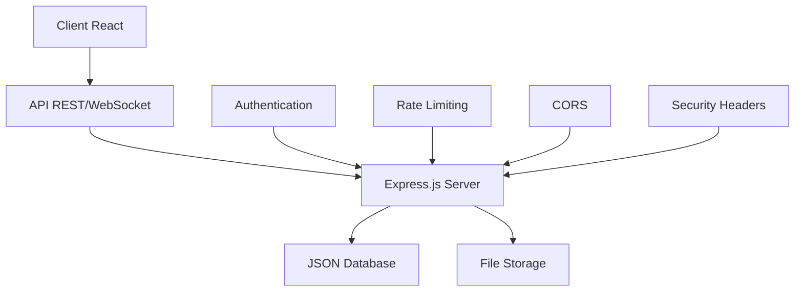

# 🏗️ Architecture Technique - Riziky-Boutic

## 📋 Table des Matières
- [Vue d'ensemble architecturale](#vue-densemble-architecturale)
- [Architecture Frontend](#architecture-frontend)
- [Architecture Backend](#architecture-backend)
- [Patterns et principes](#patterns-et-principes)
- [Sécurité](#sécurité)
- [Performance](#performance)
- [Scalabilité](#scalabilité)

## 🎯 Vue d'ensemble architecturale

### Principes architecturaux
- **Separation of Concerns** : Séparation claire entre frontend et backend
- **Layered Architecture** : Architecture en couches pour la maintenabilité
- **Microservices Ready** : Préparation pour une évolution microservices
- **Security First** : Sécurité intégrée dès la conception

### Stack technologique global


## 🎨 Architecture Frontend

### Structure modulaire
```
src/
├── app/                      # Configuration et bootstrap
│   ├── AppProviders.tsx      # Providers globaux (Context, Query)
│   ├── AppRoutes.tsx         # Configuration routing avec sécurité
│   ├── LoadingFallback.tsx   # Fallback de chargement global
│   ├── MaintenanceChecker.tsx # Vérification mode maintenance
│   └── RegistrationChecker.tsx # Contrôle état inscriptions
├── components/               # Composants organisés par domaine
│   ├── ui/                   # Système de design (shadcn/ui)
│   ├── admin/                # Interface administration
│   ├── auth/                 # Authentification
│   ├── cart/                 # Gestion panier
│   ├── chat/                 # Communication temps réel
│   ├── checkout/             # Processus commande
│   ├── engagement/           # Engagement utilisateur
│   ├── filters/              # Filtrage produits
│   ├── flash-sale/           # Ventes flash
│   ├── home/                 # Page d'accueil
│   ├── layout/               # Layout application
│   ├── orders/               # Gestion commandes
│   ├── products/             # Catalogue produits
│   ├── profile/              # Profil utilisateur
│   ├── promotions/           # Gestion promotions
│   ├── reviews/              # Système d'avis
│   └── search/               # Recherche avancée
├── contexts/                 # Gestion état global
│   ├── AuthContext.tsx       # État authentification
│   ├── StoreContext.tsx      # État application global
│   └── VideoCallContext.tsx  # Gestion appels vidéo
├── hooks/                    # Hooks métier réutilisables
├── services/                 # Couche accès données
├── types/                    # Définitions TypeScript
├── utils/                    # Utilitaires transverses
└── pages/                    # Pages application
```

### Pattern de composants
```tsx
// Structure standardisée des composants
interface ComponentProps {
  // Props avec validation TypeScript stricte
  id?: string;
  className?: string;
  children?: React.ReactNode;
  // Props spécifiques au composant
}

const Component: React.FC<ComponentProps> = ({ 
  id,
  className,
  children,
  ...specificProps 
}) => {
  // 1. Hooks d'état local
  const [state, setState] = useState();
  
  // 2. Hooks personnalisés
  const { data, loading } = useCustomHook();
  
  // 3. Handlers d'événements
  const handleEvent = useCallback(() => {
    // Logique événement
  }, [dependencies]);
  
  // 4. Effects secondaires
  useEffect(() => {
    // Side effects
  }, [dependencies]);
  
  // 5. Conditions de rendu anticipé
  if (loading) return <LoadingSpinner />;
  if (error) return <ErrorComponent />;
  
  // 6. Rendu principal
  return (
    <div 
      id={id}
      className={cn("default-classes", className)}
    >
      {children}
    </div>
  );
};

export default Component;
```

### Gestion de l'état
```tsx
// AuthContext - Gestion authentification
const AuthContext = createContext<AuthContextType | undefined>(undefined);

export const AuthProvider: React.FC<{ children: React.ReactNode }> = ({ children }) => {
  const [user, setUser] = useState<User | null>(null);
  const [loading, setLoading] = useState(true);
  const [isAuthenticated, setIsAuthenticated] = useState(false);

  // Persistance de session
  useEffect(() => {
    const token = localStorage.getItem('token');
    if (token) {
      validateToken(token);
    } else {
      setLoading(false);
    }
  }, []);

  // Méthodes authentification
  const login = async (credentials: LoginCredentials) => {
    try {
      const response = await authAPI.login(credentials);
      const { token, user } = response.data;
      
      localStorage.setItem('token', token);
      setUser(user);
      setIsAuthenticated(true);
      
      return { success: true };
    } catch (error) {
      return { success: false, error: error.message };
    }
  };

  const logout = () => {
    localStorage.removeItem('token');
    setUser(null);
    setIsAuthenticated(false);
  };

  return (
    <AuthContext.Provider value={{ 
      user, 
      loading, 
      isAuthenticated, 
      login, 
      logout 
    }}>
      {children}
    </AuthContext.Provider>
  );
};
```

### Routing sécurisé
```tsx
// AppRoutes.tsx - Configuration des routes avec sécurité
const AppRoutes: React.FC = () => {
  const { isAuthenticated } = useAuth();
  
  useEffect(() => {
    // Initialisation des routes sécurisées avec IDs obfusqués
    initSecureRoutes();
  }, []);

  return (
    <MaintenanceChecker>
      <RegistrationChecker>
        <Routes>
          {/* Routes publiques */}
          <Route path="/" element={<HomePage />} />
          <Route path="/login" element={<LoginPage />} />
          <Route path="/register" element={<RegisterPage />} />
          
          {/* Routes protégées */}
          <Route path="/profile" element={
            <ProtectedRoute>
              <ProfilePage />
            </ProtectedRoute>
          } />
          
          {/* Routes admin avec IDs sécurisés */}
          <Route path={getSecureRoute('admin')} element={
            <SecureRoute requiredRole="admin">
              <AdminLayout />
            </SecureRoute>
          } />
          
          {/* Route 404 */}
          <Route path="*" element={<NotFound />} />
        </Routes>
      </RegistrationChecker>
    </MaintenanceChecker>
  );
};
```

## ⚙️ Architecture Backend

### Structure Express.js
```
server/
├── config/                   # Configuration modules
│   ├── auth.js              # JWT configuration
│   ├── cors.js              # CORS policy setup
│   ├── dataFiles.js         # Data files management
│   ├── errorHandlers.js     # Global error handling
│   ├── routes.js            # Routes configuration
│   └── security.js          # Security middleware config
├── core/                    # Core modules
│   └── database.js          # JSON database manager
├── data/                    # JSON data files (current DB)
├── middlewares/             # Express middlewares
│   ├── auth.js              # Authentication middleware
│   └── security.js          # Security middleware chain
├── routes/                  # API routes definition
├── services/                # Business logic services
├── socket/                  # WebSocket configuration
│   ├── socketAuth.js        # Socket authentication
│   ├── socketConfig.js      # Socket.io setup
│   └── socketHandlers.js    # Event handlers
└── uploads/                 # File upload storage
```

### Middleware Chain Pattern
```javascript
// security.js - Chaîne de sécurité middleware
const { rateLimit } = require('express-rate-limit');
const helmet = require('helmet');
const xss = require('xss-clean');

// Rate limiting configuration
const limiter = rateLimit({
  windowMs: 15 * 60 * 1000, // 15 minutes
  max: 100, // limit each IP to 100 requests per windowMs
  message: 'Too many requests from this IP',
  standardHeaders: true,
  legacyHeaders: false,
});

// Security middleware chain
const securityMiddleware = [
  helmet({
    contentSecurityPolicy: {
      directives: {
        defaultSrc: ["'self'"],
        styleSrc: ["'self'", "'unsafe-inline'"],
        scriptSrc: ["'self'"],
        imgSrc: ["'self'", "data:", "https:"],
      },
    },
  }),
  xss(), // Clean user input from malicious HTML
  limiter, // Apply rate limiting
];

module.exports = { securityMiddleware };
```

### API Route Pattern
```javascript
// routes/products.js - Pattern standardisé des routes
const express = require('express');
const router = express.Router();
const { authenticateToken, requireAdmin } = require('../middlewares/auth');
const { validateProduct } = require('../middlewares/validation');
const productsService = require('../services/products.service');

// GET /api/products - Récupérer les produits avec filtres
router.get('/', async (req, res, next) => {
  try {
    const {
      category,
      minPrice,
      maxPrice,
      sortBy = 'name',
      sortOrder = 'asc',
      page = 1,
      limit = 20,
      search
    } = req.query;

    const filters = {
      category,
      priceRange: { min: minPrice, max: maxPrice },
      search
    };

    const result = await productsService.getProducts(filters, {
      sortBy,
      sortOrder,
      page: parseInt(page),
      limit: parseInt(limit)
    });

    res.json({
      success: true,
      data: result.products,
      pagination: result.pagination,
      total: result.total
    });
  } catch (error) {
    next(error);
  }
});

// POST /api/products - Créer un produit (Admin uniquement)
router.post('/', authenticateToken, requireAdmin, validateProduct, async (req, res, next) => {
  try {
    const product = await productsService.createProduct(req.body);
    res.status(201).json({
      success: true,
      data: product,
      message: 'Produit créé avec succès'
    });
  } catch (error) {
    next(error);
  }
});

module.exports = router;
```

### WebSocket Architecture
```javascript
// socketHandlers.js - Gestion événements temps réel
const { authenticateSocket } = require('./socketAuth');

const setupSocketHandlers = (io) => {
  // Middleware d'authentification pour WebSocket
  io.use(authenticateSocket);

  io.on('connection', (socket) => {
    console.log(`User connected: ${socket.userId}`);

    // Rejoindre les rooms appropriées
    socket.join(`user_${socket.userId}`);
    if (socket.userRole === 'admin') {
      socket.join('admin_room');
    }

    // Gestionnaire chat client
    socket.on('client_message', async (data) => {
      try {
        const { message, type, file } = data;
        
        // Sauvegarder le message en base
        const savedMessage = await chatService.saveMessage({
          userId: socket.userId,
          message,
          type,
          file,
          timestamp: new Date().toISOString()
        });

        // Envoyer aux admins
        io.to('admin_room').emit('new_client_message', {
          userId: socket.userId,
          message: savedMessage
        });

        // Confirmer à l'expéditeur
        socket.emit('message_sent', { messageId: savedMessage.id });
      } catch (error) {
        socket.emit('message_error', { error: error.message });
      }
    });

    // Gestionnaire réponse admin
    socket.on('admin_reply', async (data) => {
      try {
        const { userId, message } = data;
        
        // Sauvegarder la réponse
        const savedReply = await chatService.saveAdminReply({
          userId,
          adminId: socket.userId,
          message,
          timestamp: new Date().toISOString()
        });

        // Envoyer au client
        io.to(`user_${userId}`).emit('admin_message', savedReply);
      } catch (error) {
        socket.emit('reply_error', { error: error.message });
      }
    });

    // Notification nouvelles ventes
    socket.on('new_sale', (saleData) => {
      if (socket.userRole === 'admin') {
        io.emit('sales_notification', saleData);
      }
    });

    socket.on('disconnect', () => {
      console.log(`User disconnected: ${socket.userId}`);
    });
  });
};

module.exports = { setupSocketHandlers };
```

## 🔐 Sécurité

### Authentification JWT
```javascript
// auth.js - Configuration JWT
const jwt = require('jsonwebtoken');
const bcrypt = require('bcrypt');

const JWT_SECRET = process.env.JWT_SECRET;
const JWT_EXPIRES_IN = process.env.JWT_EXPIRES_IN || '24h';

// Génération token JWT
const generateToken = (payload) => {
  return jwt.sign(payload, JWT_SECRET, { expiresIn: JWT_EXPIRES_IN });
};

// Middleware d'authentification
const authenticateToken = (req, res, next) => {
  const authHeader = req.headers['authorization'];
  const token = authHeader && authHeader.split(' ')[1];

  if (!token) {
    return res.status(401).json({ 
      success: false, 
      message: 'Token d\'accès requis' 
    });
  }

  jwt.verify(token, JWT_SECRET, (err, user) => {
    if (err) {
      return res.status(403).json({ 
        success: false, 
        message: 'Token invalide' 
      });
    }
    req.user = user;
    next();
  });
};

// Hashage sécurisé des mots de passe
const hashPassword = async (password) => {
  const saltRounds = 12;
  return await bcrypt.hash(password, saltRounds);
};

// Vérification mot de passe
const verifyPassword = async (password, hashedPassword) => {
  return await bcrypt.compare(password, hashedPassword);
};
```

### Protection des routes sensibles
```javascript
// secureIds.js - Obfuscation des IDs sensibles
const crypto = require('crypto');

const ENCRYPTION_KEY = process.env.SECURE_ID_KEY || 'default-key-change-in-prod';
const ALGORITHM = 'aes-256-cbc';

// Générer un ID sécurisé
const generateSecureId = (originalId) => {
  const cipher = crypto.createCipher(ALGORITHM, ENCRYPTION_KEY);
  let encrypted = cipher.update(originalId, 'utf8', 'hex');
  encrypted += cipher.final('hex');
  return encrypted;
};

// Décrypter un ID sécurisé
const decryptSecureId = (encryptedId) => {
  try {
    const decipher = crypto.createDecipher(ALGORITHM, ENCRYPTION_KEY);
    let decrypted = decipher.update(encryptedId, 'hex', 'utf8');
    decrypted += decipher.final('utf8');
    return decrypted;
  } catch (error) {
    throw new Error('ID sécurisé invalide');
  }
};

// Routes sécurisées
const secureRoutes = {
  admin: generateSecureId('admin'),
  products: generateSecureId('products'),
  users: generateSecureId('users'),
  orders: generateSecureId('orders')
};
```

### Validation des données
```javascript
// validation.js - Validation avec Zod
const { z } = require('zod');

// Schéma de validation produit
const productSchema = z.object({
  name: z.string().min(1, 'Nom requis').max(100, 'Nom trop long'),
  description: z.string().min(10, 'Description trop courte'),
  price: z.number().positive('Prix doit être positif'),
  category: z.string().min(1, 'Catégorie requise'),
  stock: z.number().int().min(0, 'Stock ne peut être négatif'),
  images: z.array(z.string().url()).optional(),
  tags: z.array(z.string()).optional()
});

// Middleware de validation
const validateProduct = (req, res, next) => {
  try {
    productSchema.parse(req.body);
    next();
  } catch (error) {
    return res.status(400).json({
      success: false,
      message: 'Données invalides',
      errors: error.errors
    });
  }
};
```

## 🚀 Performance

### Optimisations Frontend
```tsx
// Lazy loading des composants
const LazyComponent = React.lazy(() => import('./Component'));

// Memoization pour éviter re-renders inutiles
const ExpensiveComponent = React.memo(({ data }) => {
  const processedData = useMemo(() => {
    return expensiveCalculation(data);
  }, [data]);

  return <div>{processedData}</div>;
});

// Cache intelligent avec React Query
const useProducts = (filters) => {
  return useQuery({
    queryKey: ['products', filters],
    queryFn: () => productsAPI.getProducts(filters),
    staleTime: 5 * 60 * 1000, // 5 minutes
    cacheTime: 10 * 60 * 1000, // 10 minutes
    refetchOnWindowFocus: false,
  });
};
```

### Optimisations Backend
```javascript
// Compression des réponses
const compression = require('compression');
app.use(compression());

// Cache statique
const path = require('path');
app.use('/static', express.static(path.join(__dirname, 'public'), {
  maxAge: '1y',
  etag: false
}));

// Pagination efficace
const paginateResults = (data, page, limit) => {
  const startIndex = (page - 1) * limit;
  const endIndex = page * limit;
  
  return {
    results: data.slice(startIndex, endIndex),
    pagination: {
      current: page,
      total: Math.ceil(data.length / limit),
      hasNext: endIndex < data.length,
      hasPrev: startIndex > 0
    }
  };
};
```

## 📈 Scalabilité

### Préparation microservices
```javascript
// Structure modulaire préparant la transition
// services/products.service.js
class ProductsService {
  constructor(database) {
    this.db = database;
  }

  async getProducts(filters, options) {
    // Logique métier isolée
    // Peut être facilement extraite en microservice
  }

  async createProduct(productData) {
    // Validation et création
  }
}

// Injection de dépendance
const productsService = new ProductsService(database);
```

### Configuration environnement
```javascript
// config/environment.js
const config = {
  development: {
    database: {
      type: 'json',
      path: './data'
    },
    redis: false,
    logging: 'debug'
  },
  production: {
    database: {
      type: 'postgresql',
      url: process.env.DATABASE_URL
    },
    redis: {
      url: process.env.REDIS_URL
    },
    logging: 'error'
  }
};

module.exports = config[process.env.NODE_ENV || 'development'];
```

---

*Architecture conçue pour la robustesse, la sécurité et l'évolutivité*